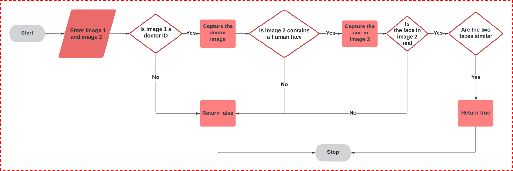

# Diagnose-Me: Mobile Application Machine Learning Pipeline

## Overview
Diagnose-Me is a mobile application designed to provide health diagnostics by leveraging the state of the art deep learning techniques. My part of the project focused on creating a Doctor Verification Process at signing up and a Breast Cancer Classification model. The Doctor Verification Process is crucial in ensuring that only licensed medical professionals can register as doctors within the app, while the Breast Cancer Classification model aids in early detection and diagnosis of breast cancer.

## Doctor Verification Process

### Introduction
The Doctor Verification Process employs a combination of computer vision and face recognition techniques to verify the identity of medical professionals. The verification process requires the doctor to submit two images: their official ID card and a selfie. This ensures that only legitimate, licensed medical professionals are registered in the application.

### Flowchart

### Steps
1. **Image Submission**: The doctor submits two images - an official ID card and a selfie.
2. **ID Card Verification**:
    - The system checks if the first image is a doctor ID card.
    - If the image is not a doctor ID, the process returns false and stops.
    - If the image is a doctor ID, the system captures the doctor image from the ID.
3. **Face Detection in Selfie**:
    - The system checks if the second image contains a human face.
    - If no face is detected, the process returns false and stops.
    - If a face is detected, the system captures the face from the selfie.
4. **Face Verification**:
    - The system verifies if the face in the selfie is real (not spoofed).
    - If the face is not real, the process returns false and stops.
    - If the face is real, the system compares it with the face on the ID card.
5. **Face Comparison**:
    - The system checks if the two faces are similar.
    - If the faces are similar, the process returns true, confirming the doctor's identity.
    - If the faces are not similar, the process returns false.

### Models Used
1. **Doctor's ID Card Detection**: [Object Detection with YOLO for Doctor's ID Cards](https://github.com/mohamedamara7/Object-Detection-with-YOLO-for-Doctor-s-ID-Cards)
2. **Face Anti-Spoofing**: [Domain-Invariant Neural Network For Face Anti-Spoofing](https://github.com/mohamedamara7/Domain-Invariant-Neural-Network-For-Face-Ant-Spoofing)
3. **Face Recognition**: [ArcFace-TF2.0](https://github.com/mohamedamara7/ArcFace-TF2.0)

## Breast Cancer Classification

### Introduction
The Breast Cancer Classification model is designed to assist in the early detection and diagnosis of breast cancer. It uses advanced machine learning techniques to analyze medical images and predict the presence of cancerous cells.

### Model Used
- [Breast Cancer Classification](https://github.com/mohamedamara7/Improved-Model-Training-Procedure-for-ICIAR-2018-Grand-Challenge-Part-A-/tree/main)

## Conclusion
Diagnose-Me leverages cutting-edge machine learning models to ensure the authenticity of medical professionals and aid in critical health diagnostics. The Doctor Verification Process and Breast Cancer Classification model exemplify the application’s commitment to accuracy and reliability in healthcare technology.
